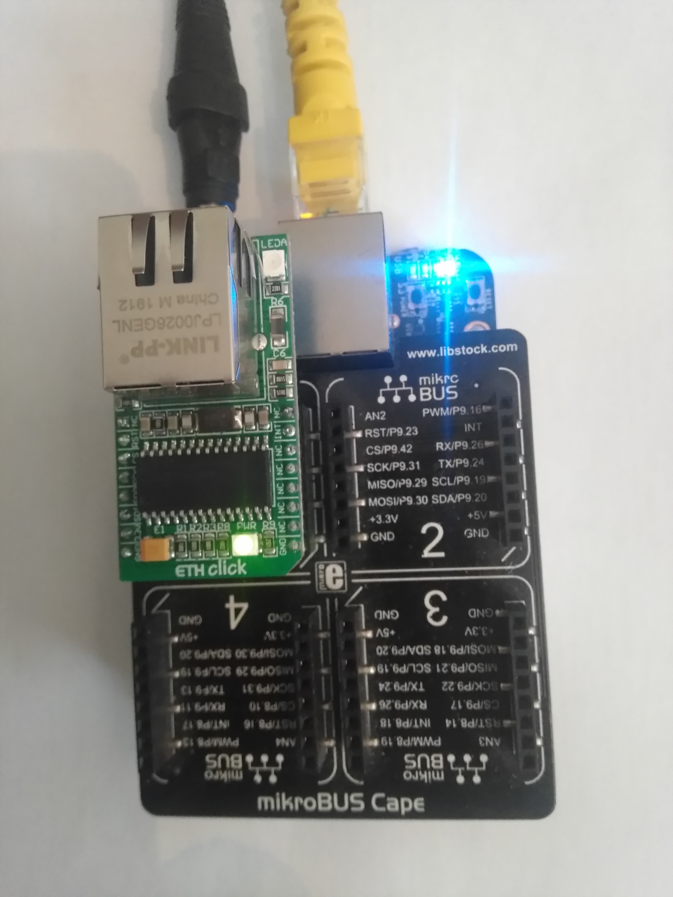

## ETH-CLICK
https://www.mikroe.com/eth-click

### Explored Embedded HW Configuration:



### Overlay Hierarchy

#### Custom Made Patchwork

```
/*
 * Copyright (C) 2017 Robert Nelson <robertcnelson@gmail.com>
 *
 * This program is free software; you can redistribute it and/or modify
 * it under the terms of the GNU General Public License version 2 as
 * published by the Free Software Foundation.
 *
 * https://www.mikroe.com/eth-click
 * https://download.mikroe.com/documents/add-on-boards/click/eth/eth-click-manual-v100.pdf
 */

/dts-v1/;
/plugin/;

// #include <dt-bindings/gpio/gpio.h>
// #include <dt-bindings/pinctrl/am33xx.h>
// #include <dt-bindings/interrupt-controller/irq.h>

/ {
	compatible = "ti,beaglebone", "ti,beaglebone-black", "ti,beaglebone-green";

	/* identification */
	part-number = "PB-SPI0-ETH-CLICK";
	version = "00A0";

	/* state the resources this cape uses */
	exclusive-use =
		/* the pin header uses */
		"P9.17",	/* P9_17 (A16) spi0_cs0.spi0_cs0 */
		"P9.18",	/* P9_18 (B16) spi0_d1.spi0_d1 */
		"P9.21",	/* P9_21 (B17) spi0_d0.spi0_d0 */
		"P9.22",	/* P9_22 (A17) spi0_sclk.spi0_sclk */
		/* the hardware ip uses */
		"spi0";

	/*
	 * Helper to show loaded overlays under: /proc/device-tree/chosen/overlays/
	 */
	fragment@0 {
		target-path="/";
		__overlay__ {

			chosen {
				overlays {
					// PB-SPI0-ETH-CLICK-00A0 = __TIMESTAMP__;
					PB-SPI0-ETH-CLICK-00A0 = "Mon Mar 30 15:08:20 2020";
				};
			};
		};
	};

	/*
	 * Free up the pins used by the cape from the pinmux helpers.
	 */
	fragment@1 {
		target = <&ocp>;
		__overlay__ {
			P9_17_pinmux { status = "disabled"; };	/* P9_17 (A16) spi0_cs0.spi0_cs0 */
			P9_18_pinmux { status = "disabled"; };	/* P9_18 (B16) spi0_d1.spi0_d1 */
			P9_21_pinmux { status = "disabled"; };	/* P9_21 (B17) spi0_d0.spi0_d0 */
			P9_22_pinmux { status = "disabled"; };	/* P9_22 (A17) spi0_sclk.spi0_sclk */
		};
	};


	fragment@2 {
		target = <&am33xx_pinmux>;
		__overlay__ {
			enc28j60_pins: pinmux_enc28j60_pins {
				pinctrl-single,pins = <0x00000024 0x0000002f 0x000000ec 0x0000002f>;
				// pinctrl-single,pins = <
				//	AM33XX_IOPAD(0x0824, PIN_INPUT | MUX_MODE7 ) /* (T10) gpmc_ad9.gpio0[23] INT */
				//	AM33XX_IOPAD(0x08ec, PIN_INPUT | MUX_MODE7 ) /* (R6) lcd_ac_bias_en.gpio2[25] RESET */
				// >;
			};

			pb_spi0_pins: pinmux_pb_spi0_pins {
				pinctrl-single,pins = <0x00000150 0x00000028 0x00000154 0x00000028 0x00000158 0x00000028 0x0000015c 0x00000028>;
				// pinctrl-single,pins = <
				//	AM33XX_IOPAD(0x0950, PIN_INPUT | MUX_MODE0 ) /* P9_22 (A17) spi0_sclk.spi0_sclk */
				//	AM33XX_IOPAD(0x0954, PIN_INPUT | MUX_MODE0 ) /* P9_21 (B17) spi0_d0.spi0_d0 */
				//	AM33XX_IOPAD(0x0958, PIN_INPUT | MUX_MODE0 ) /* P9_18 (B16) spi0_d1.spi0_d1 */
				//	AM33XX_IOPAD(0x095c, PIN_INPUT | MUX_MODE0 ) /* P9_17 (A16) spi0_cs0.spi0_cs0 */
				// >;
			};
		};
	};

	fragment@3 {
		target = <&spi0>;
		__overlay__ {
			status = "okay";
			pinctrl-names = "default";
			pinctrl-0 = <&pb_spi0_pins>;

			channel@0{ status = "disabled"; };
			channel@1{ status = "disabled"; };
		};
	};

	fragment@4 {
		target = <&spi0>;
		__overlay__ {
			#address-cells = <1>;
			#size-cells = <0>;

			enc28j60: ethernet@0 {
				compatible = "microchip,enc28j60";
				pinctrl-names = "default";
				pinctrl-0 = <&enc28j60_pins>;
				reg = <0x0>;
				interrupt-parent = <&gpio0>;
				interrupts = <48 2>; /* IRQ_TYPE_EDGE_FALLING */
				spi-max-frequency = <16000000>;
				local-mac-address = [ 90 77 DE AD BE EF ];
			};
		};
	};
};
```

### Kernel ETH Driver Support

	CONFIG_ENC28J60:
	  │
	  │ Support for the Microchip EN28J60 ethernet chip.
	  │
	  │ To compile this driver as a module, choose M here. The module will be
	  │ called enc28j60.
	  │
	  │ Symbol: ENC28J60 [=y]
	  │ Type  : tristate
	  │ Prompt: ENC28J60 support
	  │   Location:
	  │     -> Device Drivers
	  │       -> Network device support (NETDEVICES [=y])
	  │         -> Ethernet driver support (ETHERNET [=y])
	  │           -> Microchip devices (NET_VENDOR_MICROCHIP [=y])
	  │   Defined at drivers/net/ethernet/microchip/Kconfig:19
	  │   Depends on: NETDEVICES [=y] && ETHERNET [=y] && NET_VENDOR_MICROCHIP [=y] && SPI [=y]
	  │   Selects: CRC32 [=y]

### Reading Loaded Overlays

The loaded overlays could be found in the following directory: /proc/device-tree/chosen/overlays/ :

	root@arm:/home/debian# ls -al /proc/device-tree/chosen/overlays/
	total 0
	drwxr-xr-x 2 root root  0 Apr 20 14:37 .
	drwxr-xr-x 3 root root  0 Apr 20 14:37 ..
	-r--r--r-- 1 root root 25 Apr 20 14:37 AM335X-PRU-RPROC-4-19-TI-00A0
	-r--r--r-- 1 root root 25 Apr 20 14:37 BB-ADC-00A0
	-r--r--r-- 1 root root 25 Apr 20 14:37 BB-BONE-eMMC1-01-00A0
	-r--r--r-- 1 root root 25 Apr 20 14:37 BB-HDMI-TDA998x-00A0
	-r--r--r-- 1 root root  9 Apr 20 14:37 name
	-r--r--r-- 1 root root 25 Apr 20 14:37 PB-SPI0-ETH-CLICK-00A0

### Problems detected?

Yet to be determined... Still does not work!

Most probable INT# signal needs a strong pull-up (circa 1.8K - 3.3K) on BBB Cape board.
