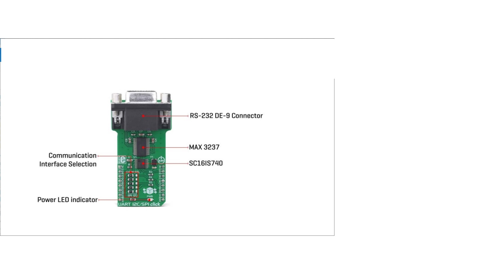

## MASTER EXAMPLE: MICROE-3349: I2C/ISP to serial I/F click

CLICK SPI/I2C to Serial Bridge Systems and Application SW, showing the CLICK Referent Design:

https://media.digikey.com/pdf/Data%20Sheets/MikroElektronika%20PDFs/MIKROE-3349_Web.pdf

#### Step 1: Click HW used in the master example

Please, find the click description from the above image:

The design of the UART I2C/SPI click is based around two integrated circuits. The first IC is the
SC16IS740, an I2C/SPI to UART interface, 64 bytes of transmit and receive FIFOs, and IrDA SIR
built-in support, from NXP. This IC bridges the data communication between the two interfaces,
offering many additional features, such as the support for the automatic hardware and software
flow control, RS-485 support and software reset of the UART. The SC16IS740 can be configured over
the SPI or I2C interface, by writing values to a 16C450 compatible set of registers. Maintaining
the backward compatibility with the widely popular 16C450 asynchronous communications element
(ACE). This allows the software to be easily written or ported from another platform.

#### Step 2: Change current kernel .config (to include SC16IS7xx driver as part of the kernel)

Please, read README.md for the better Linux kernel requirements' understanding:
https://github.com/ZoranStojsavljevic/MikroE_BeagleBone-Black-BSP_Integration/blob/master/MikroE_BBB_CLICK_Design/Systems_SW_Examples/README.md

These requirements call for the customized kernel, which does NOT come out of the box!

Please, execute the following command in the root tree source of the currently used BBB Linux kernel:

Change kernel .config:

	Debian:
	ARCH=arm CROSS_COMPILE=arm-linux-gnueabihf- make -j8 menuconfig

	Fedora:
	ARCH=arm CROSS_COMPILE=arm-linux-gnu- make -j8 menuconfig

Please, find the following options and add them to be included in the kernel:

	Symbol: SERIAL_SC16IS7XX [=y]
	  │ Type  : tristate
	  │ Prompt: SC16IS7xx serial support
	  │   Location:
	  │     -> Device Drivers
	  │       -> Character devices
	  │ (1)     -> Serial drivers
	  │   Defined at drivers/tty/serial/Kconfig:1083
	  │   Depends on: TTY [=y] && HAS_IOMEM [=y] && (SPI_MASTER [=y] && !I2C [=y] || I2C [=y])
	  │   Selects: SERIAL_CORE [=y]
	  │
	  │
	  │ Symbol: SERIAL_SC16IS7XX_CORE [=y]
	  │ Type  : tristate
	  │   Defined at drivers/tty/serial/Kconfig:1080
	  │   Depends on: TTY [=y] && HAS_IOMEM [=y]
	  │   Selected by [y]:
	  │   - SERIAL_SC16IS7XX_I2C [=y] && TTY [=y] && HAS_IOMEM [=y] && I2C [=y] && SERIAL_SC16IS7XX [=y]
	  │   - SERIAL_SC16IS7XX_SPI [=y] && TTY [=y] && HAS_IOMEM [=y] && SPI_MASTER [=y] && SERIAL_SC16IS7XX [=y]
	  │
	  │
	  │ Symbol: SERIAL_SC16IS7XX_I2C [=y]
	  │ Type  : bool
	  │ Prompt: SC16IS7xx for I2C interface
	  │   Location:
	  │     -> Device Drivers

They will appear as the following CONFIG options in the .config :

	CONFIG_SERIAL_SC16IS7XX_CORE=y
	CONFIG_SERIAL_SC16IS7XX=y
	CONFIG_SERIAL_SC16IS7XX_I2C=y
	CONFIG_SERIAL_SC16IS7XX_SPI=y

#### Step 3: Device Tree Source to be added to the .../arch/arm/boot/dts/
https://elixir.bootlin.com/linux/latest/source/Documentation/devicetree/bindings/serial/nxp,sc16is7xx.txt

To Be Continued!
